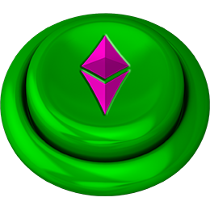

# Introduction

### Welcome to The Mint of Destiny!

The Mint of Destiny is the world's first Discord NFT game where you play entirely in Discord to win NFTs that determine your roles within the Discord Channel and it's all entirely free to play! You will want to try and level up your [Hero](tokens/heroes/) (you) quicker and higher than everyone around you by earning points, fighting [Villains](tokens/villains/), and be the one that achieves the [Mint of Destiny](gameplay/the-mint-of-destiny.md)!

Throughout the game, you will have to battle [Minions](tokens/villains/minion.md), [Mini-Bosses](tokens/villains/mini-boss.md), and [Bosses](tokens/villains/boss.md) to level your [Hero](tokens/heroes/) up. If your are successful in your challenges, you will win 1 NFT for your new role, and 1 NFT of the [Villain](tokens/villains/) that you have defeated.

If you are one of the lucky few to have defeated a [Boss](tokens/villains/boss.md) and retained all of your roles on the journey, you can attempt to [Kill Screen](tokens/kill-screens.md) the game. There are only 20 available and they increase in difficulty as they are won.

Whomever the final victor of [Kill Screen](tokens/kill-screens.md) #20 is, will be deemed THE ONE. They have proven themselves worth to the [Minting Godz ](about/minting-godz.md)and be awarded [THE MINT OF DESTINY](gameplay/the-mint-of-destiny.md)!

