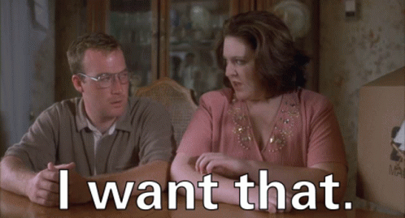

# 📘 The Story

At the beginning of time, wait... no. _BEFORE_ the beginning of time, the [Mint of Destiny](../gameplay/the-mint-of-destiny.md) was forged by the [Minting Godz](minting-godz.md) in fires of a birthing star (yes... time hasn't started yet. Go with me here). When the creatures from the dark side of the birthing star (maybe behind a moon or something) saw the radiating glow that is the Mint of Destiny, they were stunned and proclaimed:

So being the bad guys that they are, they immediately stole it and hid it away inside an impossible labyrinth of un-updatable code. And for some reason unbeknownst to any mere mortal, they told everyone about it, and challenged the Etherverse Heroes to come and get it. They reportedly even taunted the Heroes with "Nana nana boo boo!". Srsly... they did that.

And here is where time started, from the sheer rage of the Minting Godz by losing the Mint of Destiny to the Villains! It cause a giant explosion (aka... the Big Bang) and sent tiny bits of silicon all over the Etherverse that eventually evolved into Hero NFTs over billions of years. May even a gigatrillion years. A long time... that's what we're trying to say here. Anyway, now that the Hero NFTs have been born from from the stardust of the beginning, it's up to you to capture these Villains into static, one of a kind, silicon wafers (where do you think the idea of carboinite came from? Yup, Villain NFTs) and achieve the impossible task of reaching the Mint of Destiny. To prove to the Minting Godz that you have it, you will have to prove that you are worthy by ringing the Galaxian bell that is the Big Green Button! For accomplishing such a feat, the Minting Godz will reward this singular Hero with so much silicon treasure (more NFTs) stored away in the Vault, that their tiny little head would explode if it wasn't so big to hold all of their ego.
