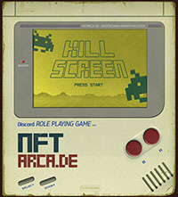

# Kill Screens



Kill Screens are the infamous "_Holy crap, you've gone farther in the game than was ever intended, so now it just breaks the code and dies_" screens from some of the most popular games that created the video game industry as we know it.

We wanted to pay an homage to them and offer up the ability for the most god-like players that want to prove their reign over everyone else in the game.

### How Many Kill Screens Are There?

There are only 20 [Kill Screen Tokens](../tokens/kill-screens.md) that can be won, each with their own [difficulty level](kill-screens.md#kill-screen-difficulty-levels).

### How To Try For a Kill Screen?

You will need a few things first before you even _think_ about attempting a Kill Screen!&#x20;

* [n00b](../tokens/heroes/n00b.md) NFT
* [Hardcore](../tokens/heroes/hardcore.md) NFT
* [Legendary](../tokens/heroes/legendary.md) NFT
* [4,200 Points](earning-points.md)

Once you have all of those you can run the following command in Discord to launch the next step in the Kill Screen prep command to verify your supreme gaming abilities (that you meet the requirements to try):

```
/killscreen prep
```

You will be presented with the confirmation that you want to proceed with a Kill Screen attempt, and that by doing so, you will immediately lose 2,100 points for the attempt. Should you win the Kill Screen, you will receive all of your points back plus the Kill Screen NFT!

Once you confirm, the bot will then register your account on the blockchain to be open for an attempt on the Kill Screen and 2,100 points will be taken from your account.

Next you will need to launch the Kill Screen attack:

```
/killscreen stake
```

When you launch the Kill Screen stake command, a browser will be opened and take you to the Mint of Destiny website where you will have to stake all three of your NFTs (n00b, Hardcore, and Legendary). Once all of your NFTs have been staked, you can return to the Discord to issue the final command, the Kill Screen Attack!

```
/killscreen attack
```

You've laid it all out on the line, and now comes the moment of truth! Depending on which Kill Screen number you are attempting will determine the difficulty of the attack.&#x20;


<mark style="color:red;">**IMPORTANT:**</mark> The Kill Screens are attempted _in order_, so it's _<mark style="color:purple;">MASSIVELY</mark>_ beneficial to get there before everyone else does!


### If You Are Successful

You will have just proven to the world that you are an Über-Elite Templar Ninja of Sorcery that can bend space and time as we know it! You will have your accomplishments etched for all time to the Kill Screen Title Holders page of the website, you will receive your 2,100 points back, and you will have a 1-of-20 NFT of the worlds most awesome game that has ever existed!

Additionally, all Kill Screen holders will receive an NFT via freelist or airdrop to their wallet of every game that NFTArcade puts out FOREVER!


<mark style="color:purple;">**The winner of Kill Screen #20 will be immediately awarded THE MINT OF DESTINY!**</mark>


Angles will sing from above, the community will rejoice of your seemingly impossible accomplishment, and your enemies will be forever mega-jelly of your undeniable social status as the one and only true holder of [THE MINT OF DESTINY!](broken-reference)

With your new-found worthiness, you can now push the Big Green Button and claim all of your spoils from [The Vault](the-vault.md)!

### If You Lose

Should you lose at the Kill Screen attempt, you will have forfeited the 2,100 points you originally put up, and all of your staked NFTs will be <mark style="color:red;background-color:orange;">**🔥   BURNED  🔥**</mark> &#x20;

If you want to take another shot at a Kill Screen you will have to earn back enough points and purchase the necessary Hero Tokens from the secondary market.

### Kill Screen Difficulty Levels

| Kill Screen Number | Chance of Winning | Status                                          |
| ------------------ | ----------------- | ----------------------------------------------- |
| 1                  | 100%              | <mark style="color:green;">**Available**</mark> |
| 2                  | 95%               | <mark style="color:green;">**Available**</mark> |
| 3                  | 90%               | <mark style="color:green;">**Available**</mark> |
| 4                  | 85%               | <mark style="color:green;">**Available**</mark> |
| 5                  | 80%               | <mark style="color:green;">**Available**</mark> |
| 6                  | 75%               | <mark style="color:green;">**Available**</mark> |
| 7                  | 70%               | <mark style="color:green;">**Available**</mark> |
| 8                  | 65%               | <mark style="color:green;">**Available**</mark> |
| 9                  | 60%               | <mark style="color:green;">**Available**</mark> |
| 10                 | 55%               | <mark style="color:green;">**Available**</mark> |
| 11                 | 50%               | <mark style="color:green;">**Available**</mark> |
| 12                 | 45%               | <mark style="color:green;">**Available**</mark> |
| 13                 | 40%               | <mark style="color:green;">**Available**</mark> |
| 14                 | 35%               | <mark style="color:green;">**Available**</mark> |
| 15                 | 30%               | <mark style="color:green;">**Available**</mark> |
| 16                 | 25%               | <mark style="color:green;">**Available**</mark> |
| 17                 | 20%               | <mark style="color:green;">**Available**</mark> |
| 18                 | 15%               | <mark style="color:green;">**Available**</mark> |
| 19                 | 10%               | <mark style="color:green;">**Available**</mark> |
| 20                 | 5%                | <mark style="color:green;">**Available**</mark> |
