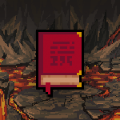

# 🔥 Fire

The Dark Elemental Book of Fire is the most rare of the elements. Fire, embers, ash, and smoke become as easy to manipulate as a sword or your own voice. Catastrophic damage is at your fingertips.

## Spells

Various spells can be [/cast](../../discord-bot/cast.md) by players that have [Warlock](../villains/warlocks/). Various spells are available for each chapter that they have opened.

## Locked Book

Players cannot cast spells with a locked book. They will first have to [/unlock](../../discord-bot/unlock.md) it.

## Chapter 1

### <mark style="color:purple;">Fire</mark>

As you are just starting to learn this Dark Elemental Magic, you can only cast random spells while you're learning the dark arts. XP, MP, and HP rewards are all determined by the random spell that was cast.

<table><thead><tr><th>Attribute</th><th>Value</th><th data-hidden></th></tr></thead><tbody><tr><td>Spell Command</td><td>Fire</td><td></td></tr><tr><td>Chance of Success</td><td>50%</td><td></td></tr><tr><td>Cool Down</td><td>15 Minutes</td><td></td></tr><tr><td> MP Cost to Target Spell</td><td>2</td><td></td></tr><tr><td> Bonus</td><td>None</td><td></td></tr></tbody></table>

## Chapter 2

### <mark style="color:purple;">Sear</mark>

As you are just starting to learn this Dark Elemental Magic, you can only cast random spells while you're learning the dark arts.

<table><thead><tr><th>Attribute</th><th>Value</th><th data-hidden></th></tr></thead><tbody><tr><td>Spell Command</td><td>sear</td><td></td></tr><tr><td>Chance of Success</td><td>70%</td><td></td></tr><tr><td>Cool Down</td><td>15 Minutes</td><td></td></tr><tr><td> MP Cost to Target Spell</td><td>2</td><td></td></tr><tr><td> Bonus</td><td>None</td><td></td></tr></tbody></table>

| Attribute                                                                   | Value on Success | Value on Fail |
| --------------------------------------------------------------------------- | ---------------- | ------------- |
|  XP | 20               | 10            |
|  MP | 1                | 1             |
|  HP | 2-4              | -1            |
| Rupeez                           | 0                | 0             |

More spells are in the works!

## Chapter 3

More spells are in the works!

## Chapter 4

More spells are in the works!

## Chapter 5

More spells are in the works!

## Chapter 6

More spells are in the works!

