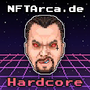

# Hardcore

The Hardcore role is the second role that a Hero can earn in the game. This role is granted to those that have shown extreme skill in the game and are truly on the quest of greatness to attain the Mint of Destiny!

### How To Earn Hardcore

Just as there are no shortcuts in life, there are no shortcuts to reach the Mint of Destiny. You must have already defeated a [Minion](../villains/minion.md) and acquired the [n00b](n00b.md) role to be able to attempt to win the Hardcore role. Once you have earned 500 points, you can attempt to [/fight](../../discord-bot/fight.md) a [Mini-Boss](../villains/mini-boss.md). If you are successful in defeating the [Mini-Boss](../villains/mini-boss.md), you will be granted the Hardcore role, a Hardcore Hero NFT, and the NFT of the [Mini-Boss](../villains/mini-boss.md) that you have defeated.

### Hardcore Discord Role

If you have made it to Hardcore, you are a true warrior, and the Minting Godz have started paying attention to you! You will now have access to Discord channels that only those with the Hardcore role can view. You will receive private alpha to this game and others ahead of the n00bs and Lurkers!

