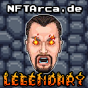

# Legendary

The Legendary role is the third and final role that a Hero can earn in the game. If you have the good fortune to see this role attached to your Hero, you can rest assured that you have secured your spot into greatness that only a select few can attain. Those that earn Legendary status make Navy Seals look like a group of kids in the shallow end with those arm floaty things on them.

### How To Earn Hardcore

As it was before, so it is again. You must have already defeated a [Mini-Boss](../villains/mini-boss.md) and acquired the [Hardcore](hardcore.md) role to be able to attempt to win the Legendary role. Once you have earned enough points, you can attempt to [Fight](../../gameplay/fighting.md) a [Boss](../villains/boss.md). If you are successful in defeating the [Boss](../villains/boss.md), you will be granted the Legendary role, a Legendary Hero NFT, and the NFT of the [Boss](../villains/boss.md) that you have defeated. There are only 1,000 Legendary roles that can be minted. Only those with supreme dedication to being able to even _think_ of touching the Mint of Destiny will have made it this far.

### Legendary Discord Role

For those that have somehow made it this far, you now have the ear of the [Minting Godz](../../about/minting-godz.md). Prepare for rewards to be presented to you in channels that only you have access to. Access to private whitelists, and even the possibility of being airdropped future NFTs in the NFTArcade!

### Details

|                          |                             |
| ------------------------ | --------------------------- |
| Hero Level               | 3                           |
| Villain to Defeat        | [Boss](../villains/boss.md) |
| Token Minting Cap        | 1,000                       |
| Minting Cost             | Free                        |
| Can Be Burned for Points | No                          |

