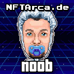

# n00b

The n00b Role is the first Hero role in the game. You must earn this role by proving that you understand the basic mechanics of the game and are not a total plebe. With such a mythical race to attain such a coveted treasure that is Mint of Destiny, we must filter out those that do not have commitment.

### How To Earn n00b

First you must have already join the game in Discord ([/join](../../discord-bot/join.md)). After you have joined into the game, you will now begin to earn points. Once you have earned 100 points, you can attempt to [/fight](../../discord-bot/fight.md) a [Minion](../villains/minion.md). If you are successful in defeating the [Minion](../villains/minion.md), you will be granted the n00b role, a n00b Hero NFT, and the NFT of the [Minion](../villains/minion.md) that you have defeated. There are only 5,000 n00b roles that can be minted. This means that only 5,000 people will be able to play the game and try to reach the seemingly impossible goal of minting the 1-of-1-of-1 Mint of Destiny!

### n00b Discord Role

Congratulations! If you've reached n00b status, you're well on your way to achieving greatness! There is a special Discord channel for those that have really begun their path to have the remote possibility of pushing the Big Green Button with the Mint of Destiny in clutch! Here you can work out strategies and help your fellow heroes, or feed them false propaganda to weasel your way ahead. There is only 1 Mint of Destiny and how you play the game is up to you!

### Details

|                         |       |
| ----------------------- | ----- |
| Hero Level              | 3     |
| Points to Fight Villain | 100   |
| Token Minting Cap       | 5,000 |
| Minting Cost            | Free  |
|                         |       |
