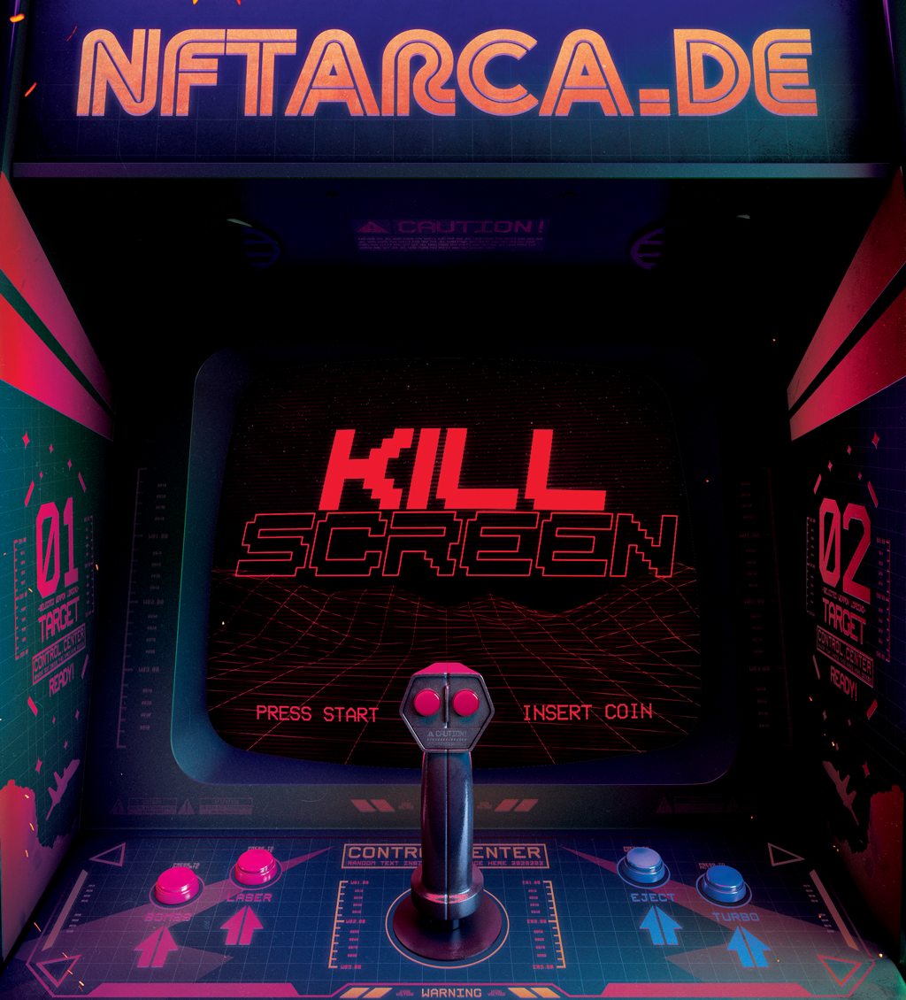
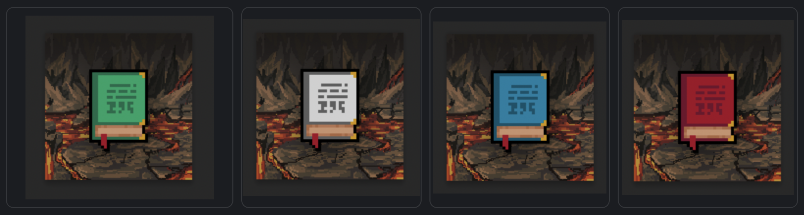

# 👾 Kill Screens



Kill Screens are the infamous "_Holy crap, you've gone farther in the game than was ever intended, so now it just breaks the code and dies_" screens from some of the most popular games that created the video game industry as we know it.

We wanted to pay an homage to them and offer up the ability for the most god-like players that want to prove their reign over everyone else in the game.

### How Many Kill Screens Are There?

There are only 20 Kill Screen Tokens that can be won, each with their own [difficulty level](kill-screens.md#kill-screen-difficulty-levels).

### How To Try For a Kill Screen?

You will need a few things first before you even _think_ about attempting a Kill Screen!&#x20;

* [n00b](heroes/n00b.md) NFT
* [Hardcore](heroes/hardcore.md) NFT
* [Legendary](heroes/legendary.md) NFT
* [4,200 Rupeez](../gameplay/earning-points/)

Once you have all of those you can run the [<mark style="color:purple;">**/killscreen**</mark>](../discord-bot/killscreen.md) command in Discord to launch the next step in the Kill Screen prep command to verify your supreme gaming abilities (that you meet the requirements to try):

```
/killscreen [n00b Token ID] [Hardcore Token ID] [Legendary Token ID]

eg:
/killscreen 2342 5634 8043
```

You will be presented with the confirmation that you want to proceed with a Kill Screen attempt, and that by doing so, you will be putting those NFTs up for chance. You've laid it all out on the line, and now comes the moment of truth! Depending on which Kill Screen number you are attempting will determine [the difficulty of the attack](kill-screens.md#kill-screen-difficulty-levels). Obviously, you can only enter token IDs of tokens that you own (and yes, we verify on the chain to make sure 😈)


<mark style="color:red;">**IMPORTANT:**</mark> The Kill Screens are attempted _in order_, so it's _<mark style="color:purple;">MASSIVELY</mark>_ beneficial to get there before everyone else does!


### If You Are Successful

You will have just proven to the world that you are an Über-Elite Templar Ninja of Sorcery that can bend space and time as we know it! You will have your accomplishments etched for all time to the Kill Screen Title Holders page of the website, your Rupeez stay intact, your NFTs you put up for the attempts are safe and cozy in your wallet, and you will have a 1-of-20 NFT of the worlds most awesome game that has ever existed!

Additionally, all Kill Screen holders will receive a guaranteed whitelist spot or airdrop to their wallet of every main NFT that NFTArcade makes for a game FOREVER!


<mark style="color:purple;">**Only 1 Kill Screen can be awarded per wallet! So choose wisely which one you're going for!**</mark>


#### Winner of Kill Screen #20


<mark style="color:purple;">**The winner of Kill Screen #20 will be immediately awarded THE MINT OF DESTINY!**</mark>


Angles will sing from above, the community will rejoice of your seemingly impossible accomplishment, and your enemies will be forever mega-jelly of your undeniable social status as the one and only true holder of [THE MINT OF DESTINY!](broken-reference)

With your new-found worthiness, you can now push the Big Green Button and claim all of your spoils from [The Vault](../gameplay/the-vault.md)!

### If You Lose

Should you lose at the Kill Screen attempt, you will forfeit 2,100 Rupeez and all of your NFTs that you  listed in the command will be <mark style="color:red;background-color:orange;">**🔥   BURNED  🔥**</mark>&#x20;

Yes, burned! Not only will you loose the NFTs, but they will be removed from the game FOREVER!

If you want to take another shot at a Kill Screen you will have to earn back enough Rupeez and purchase the necessary Hero Tokens from the secondary market.

### Kill Screen Difficulty Levels

| Kill Screen Number   | Chance of Winning | Status                                                                                                                                                                                                                                                                                                                                                                                                                                          |
| -------------------- | ----------------- | ----------------------------------------------------------------------------------------------------------------------------------------------------------------------------------------------------------------------------------------------------------------------------------------------------------------------------------------------------------------------------------------------------------------------------------------------- |
| 1                    | 100%              | <mark style="color:purple;">****</mark>[<mark style="color:purple;">**Won! View on OS**</mark>](https://opensea.io/assets/matic/0x75217de3968f9474cb29b5ea7139e33a1b6c7f69/2)<mark style="color:purple;">****</mark>.png>)<mark style="color:purple;">****</mark>                                                                                                                                              |
| 2                    | 95%               | <mark style="color:purple;">****</mark>[<mark style="color:purple;">**Won! View on OS**</mark>](https://opensea.io/assets/matic/0x75217de3968f9474cb29b5ea7139e33a1b6c7f69/3)<mark style="color:purple;">****</mark>                                                                                                                                               |
| 3                    | 90%               | <mark style="color:purple;">**Won!**</mark> [<mark style="color:purple;">**View on OS**</mark>](https://opensea.io/assets/matic/0x75217de3968f9474cb29b5ea7139e33a1b6c7f69/4)<mark style="color:purple;">****</mark> (1) (2).png>)<mark style="color:green;">****</mark>                                                                                                                                       |
| 4                    | 85%               | <p><mark style="color:green;"><strong></strong></mark><a href="https://opensea.io/assets/matic/0x75217de3968f9474cb29b5ea7139e33a1b6c7f69/5"><mark style="color:purple;"><strong>Won! View on OS</strong></mark></a><mark style="color:green;"><strong></strong></mark><br><mark style="color:green;"><strong></strong></mark><mark style="color:green;"><strong></strong></mark></p>    |
| 5                    | 80%               | <p><mark style="color:green;"><strong></strong></mark><a href="https://opensea.io/assets/matic/0x75217de3968f9474cb29b5ea7139e33a1b6c7f69/6"><mark style="color:purple;"><strong>Won! View on OS</strong></mark><br><mark style="color:purple;"><strong></strong></mark></a><mark style="color:purple;"><strong></strong></mark><mark style="color:purple;"><strong></strong></mark></p>     |
| 6                    | 75%               | <p><mark style="color:green;"><strong></strong></mark><a href="https://opensea.io/assets/matic/0x75217de3968f9474cb29b5ea7139e33a1b6c7f69/7"><mark style="color:purple;"><strong>Won! View on OS</strong></mark><br><mark style="color:purple;"><strong></strong></mark></a><mark style="color:purple;"><strong></strong></mark><mark style="color:purple;"><strong></strong></mark></p>     |
| 7                    | 70%               | <p><mark style="color:green;"><strong></strong></mark><a href="https://opensea.io/assets/matic/0x75217de3968f9474cb29b5ea7139e33a1b6c7f69/8"><mark style="color:purple;"><strong>Won! View on OS</strong></mark><br><mark style="color:purple;"><strong></strong></mark></a><mark style="color:purple;"><strong></strong></mark><mark style="color:purple;"><strong></strong></mark></p>     |
| 8                    | 65%               | <p><mark style="color:green;"><strong></strong></mark><a href="https://opensea.io/assets/matic/0x75217de3968f9474cb29b5ea7139e33a1b6c7f69/9"><mark style="color:purple;"><strong>Won! View on OS</strong></mark></a><mark style="color:purple;"><strong></strong></mark><br><mark style="color:purple;"><strong></strong></mark><mark style="color:purple;"><strong></strong></mark></p> |
| 9                    | 60%               | <p><mark style="color:purple;"><strong></strong></mark><a href="https://opensea.io/assets/matic/0x75217de3968f9474cb29b5ea7139e33a1b6c7f69/10"><mark style="color:purple;"><strong>Won! View on OS</strong></mark><br><mark style="color:purple;"><strong></strong></mark></a><mark style="color:purple;"><strong></strong></mark><mark style="color:purple;"><strong></strong></mark></p>   |
| 10                   | 55%               | <p><mark style="color:green;"><strong></strong></mark><a href="https://opensea.io/assets/matic/0x75217de3968f9474cb29b5ea7139e33a1b6c7f69/11"><mark style="color:purple;"><strong>Won! View on OS</strong></mark></a><mark style="color:green;"><strong></strong></mark><br><mark style="color:green;"><strong></strong></mark><mark style="color:green;"><strong></strong></mark></p>           |
| 11                   | 50%               | <mark style="color:green;">**Available**</mark>                                                                                                                                                                                                                                                                                                                                                                                                 |
| 12                   | 45%               | <mark style="color:green;">**Available**</mark>                                                                                                                                                                                                                                                                                                                                                                                                 |
| 13                   | 40%               | <mark style="color:green;">**Available**</mark>                                                                                                                                                                                                                                                                                                                                                                                                 |
| 14                   | 35%               | <mark style="color:green;">**Available**</mark>                                                                                                                                                                                                                                                                                                                                                                                                 |
| 15                   | 30%               | <mark style="color:green;">**Available**</mark>                                                                                                                                                                                                                                                                                                                                                                                                 |
| 16                   | 25%               | <mark style="color:green;">**Available**</mark>                                                                                                                                                                                                                                                                                                                                                                                                 |
| 17                   | 20%               | <mark style="color:green;">**Available**</mark>                                                                                                                                                                                                                                                                                                                                                                                                 |
| 18                   | 15%               | <mark style="color:green;">**Available**</mark>                                                                                                                                                                                                                                                                                                                                                                                                 |
| 19                   | 10%               | <mark style="color:green;">**Available**</mark>                                                                                                                                                                                                                                                                                                                                                                                                 |
| 20 / Mint Of Destiny | 5%                | <mark style="color:green;">**Available**</mark>                                                                                                                                                                                                                                                                                                                                                                                                 |
