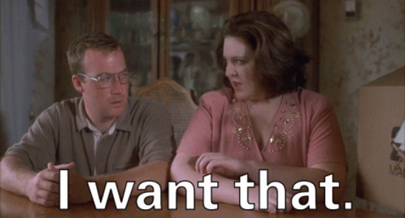

# Villains

### What Are Villains?

At the beginning of time, wait... no. _BEFORE_ the beginning of time, the Mint of Destiny was forged by the [Minting Godz](../../about/minting-godz.md) in fires of a birthing star (yes... time hasn't started yet. Go with me here). When the creatures from the dark side of the birthing star (maybe behind a moon or something) saw the radiating glow of the Mint of Destiny, they were stunned and proclaimed:

So being the bad guys that they are, they immediately stole it and hid it away inside an impossible labyrinth of un-updatable code. And for some reason unbeknownst to any mere mortal, they told everyone about it and challenged the Etherverse Heroes to come and get it. They reportedly even taunted the Heroes with "Nana nana booboo


<mark style="color:red;">**IMPORTANT**</mark>: You can only earn 1 Villain NFT per wallet / discord name from fighting. Once you fight a Minion and win a n00b NFT, you can no longer win additional n00b or Minion NFTs. So if you sell it, the only want to get it back is to buy it back on a secondary market.


There are three types of Villains within The Mint of Destiny Etherverse:

* <mark style="color:purple;">**Minions**</mark> - More annoying than scary
* <mark style="color:purple;">**Mini-Bosses**</mark> - Challenging but drunk most of the time
* <mark style="color:purple;">**Bosses**</mark> - They take their job seriously, and get joy from slaying Heroes
