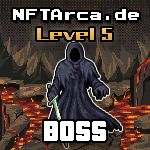

# Boss



Bosses are the eternal Gatekeepers of the Etherverse. Their sole purpose of existence is to smite down all those that challenge them. Bosses are ranked from Level 5 to Level 7. This means you have a 50% - 70% chance of losing when fighting a Boss.

### How to Defeat a Boss

First, you must have already defeated a [Mini-Boss](mini-boss.md) and achieved the role of Hardcore. Just because you talk a lot doesn't mean you have proven yourself to be able to challenge a boss. Then, and only then, once you have earned enough points, you can attempt to [fight](../../gameplay/fighting.md) a Boss. If you are successful in defeating the Boss, you will be granted the Legendary role, a Legendary Hero NFT, and the NFT of the Boss that you have defeated. There are only 1,000 Bosses that can be minted.&#x20;

To fight a Boss, issue the following command in discord once you have at least 1,500 points:

```
/fight boss
```

