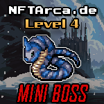

# Mini-Boss



Mini-Bosses patrol the Etherverse keeping all of the Minions in check. They make sure that the they're not slacking off at the [Drunken Wizard](https://drunkenwizard.nftarca.de) getting utterly obliterated. Mini-Bosses are ranked from Level 3 to Level 5. This means you have a 30% - 50% chance of losing when fighting a Mini-Boss.

### How To Defeat a Mini-Boss

First, you must have already joined the game in Discord ([/join](../../discord-bot/join.md)). After you have joined into the game, you will now begin to earn points. Once you have earned enough points, you can attempt to [fight](../../gameplay/fighting.md) a Mini-Boss. If you are successful in defeating the [Minion](minion.md), you will be granted the n00b role, a n00b Hero NFT, and the NFT of the [Minion](minion.md) that you have defeated. There are only 5,000 Minions that can be minted.&#x20;

To fight a minion, issue the following command in discord once you have at least 100 points:

```
/fight mini-boss
```

|                              |          |
| ---------------------------- | -------- |
| Mini-Boss Levels             | 3-5      |
| Role Needed to Fight         | n00b     |
| Role Acquired When You Win   | Hardcore |
| Token Minting Cap            | 2,500    |
| Points Needed to Fight       | 500      |
| Points Deducted if You Lose  | 250      |
| Points Deducted if You Run   | 125      |
| Ownership Points When Fought | 50       |

###
