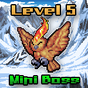

# Mini-Boss



Mini-Bosses patrol the Etherverse keeping all of the Minions in check. They make sure that the they're not slacking off at the [Drunken Wizard](https://drunkenwizard.nftarca.de) getting utterly obliterated. Mini-Bosses are ranked from Level 4 to Level 6. This means you have a 40% - 60% chance of losing when fighting a Mini-Boss.

### How To Defeat a Mini-Boss

First, you must have already defeated a Minion in a fight and have the n00b role. If you have the n00b role and you have earned enough Rupeez, you can attempt to [fight](../../gameplay/fighting.md) a Mini-Boss. If you are successful in defeating the Mini-Boss, you will be granted the Hardcore role, a Hardcore Hero NFT, and the NFT of the Mini-Boss that you have defeated. There are only 2,500 Mini-Bosses that can be minted.&#x20;

To fight a Mini-Boss, issue the following command in discord once you have at least 500 Rupeez and do not have the Hardcore role:

```
/fight
```

| Mini-Boss Levels                                                                  | 4-6      |
| --------------------------------------------------------------------------------- | -------- |
| Role Needed to Fight                                                              | n00b     |
| Role Acquired When You Win                                                        | Hardcore |
| Token Minting Cap                                                                 | 2,500    |
| Rupeez Needed to Fight                                                            | 500      |
| Rupeez Deducted if You Lose                                                       | 100      |
| Rupeez Deducted if You Run                                                        | 25       |
| [Ownership Rupeez](../../gameplay/earning-points/ownership-points.md) When Fought | 50       |

###
