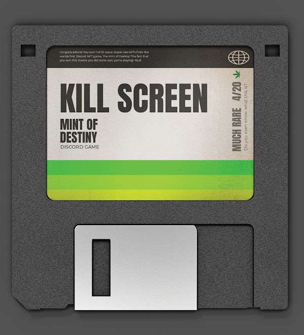

# Mini-Boss Types

### Phirefly

.png>)

### Lavafly

.png>)

### Hallow

.png>)

### Bat-a-Cat

 (1).png>)

### Poison Noodle

.png>)

### Sly Noodle

 (1).png>)

### SeaFrost

### Frosty

.png>)

### CyToad

 (1).png>)

### CyFrog

 (1).png>)

### Dr Noodles

.png>)

### Dr Noodles III

.png>)

### Aquabat

.png>)

### Vampyre

 (1).png>)
