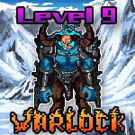

# Warlocks



Soon!

### How to Defeat a Warlock

It won't be easy. I'll tell you that =)

```
/hunt
```

| Boss Levels                                                                          | 9-11      |
| ------------------------------------------------------------------------------------ | --------- |
| Role Needed to Fight                                                                 | Legendary |
| Role Acquired When You Win                                                           | None      |
| Token Minting Cap                                                                    | 100       |
| Rupeez Needed to Fight                                                               | 3,000     |
| Rupeez Deducted if You Lose                                                          | 1,000     |
| Rupeez Deducted if You Run                                                           | 500       |
| [Ownership Rupeez](../../../gameplay/earning-points/ownership-points.md) When Fought | 250       |

