# Warlock Types

### Aqua Mage

### Baphomet

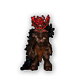

### Cathar

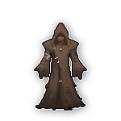

### Dave

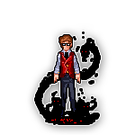

### Death

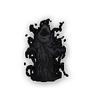

### DeathBringer

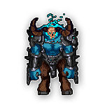

### Decaytion

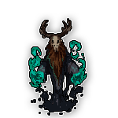

### Edenik

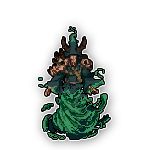

### Impik

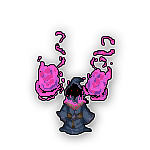

### Leprechaun

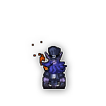

### LoPan

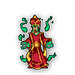

### ManBearPig

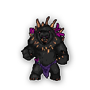

### Odnock

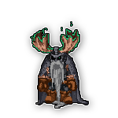

### Poison Mage

### Ravenarc

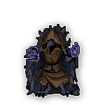

### The Watcher

### Tiki

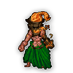

### WindShaman

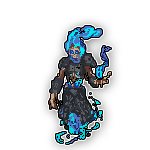

### Zathor

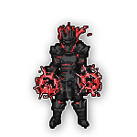

### Zuluster

.png>)

