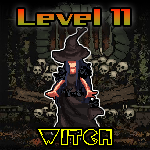

# Witches



Witches are interdimensional beings that roam the Etherverse. They were given special powers by the Minting Godz that only Warlocks possesses, the ability to summon other beings and to create portals between worlds. Witches are ranked from Level 9 to Level 11. Due to their overwhelmingly strong nature, our Heroes will need to attack them using multiple captured Villains that have been trained to hunt down Witches.

### How to Defeat a Witch

Once your hero has captured enough Villains to gain Legendary status, you can send your Villains out to [Hunt](../../../gameplay/hunting.md)! Should one of your Villains discover a Witch, you can choose to Fight it or Run away.&#x20;

```
/hunt
```

| Witch Levels                | 9-11  |
| --------------------------- | ----- |
| Villain Needed to Fight     | Boss  |
| Role Acquired When You Win  | None  |
| Token Minting Cap           | 100   |
| Rupeez Needed to Fight      | 1,000 |
| Rupeez Deducted if You Lose | 300   |
| Rupeez Deducted if You Run  | 100   |

### Witch Powers

Witch have the ability to open mystical artifacts that have been locked with dark magic.
